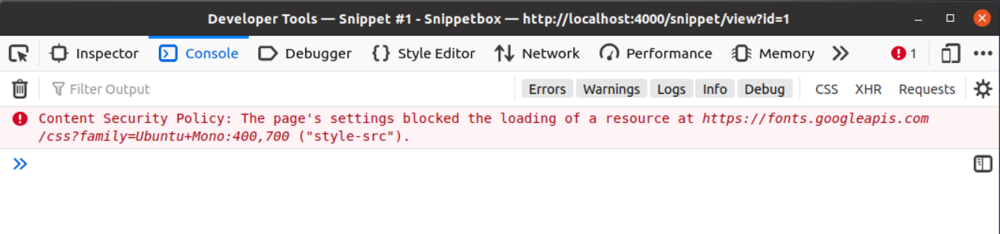

# Middleware
Когда вы создаете веб-приложение, вероятно, есть какая-то общая функциональность, которую вы хотите использовать для многих (или даже для всех) HTTP-запросов. Например, вы можете захотеть регистрировать каждый запрос, сжимать каждый ответ или проверять кэш перед передачей запроса вашим обработчикам.

Распространенный способ организации этой общей функциональности - настроить ее как промежуточное программное обеспечение. По сути, это некоторый автономный код, который независимо выполняет запрос до или после обычных обработчиков приложений.

В этом разделе книги вы узнаете:

- Идиоматический шаблон для создания и использования пользовательского промежуточного программного обеспечения, совместимого с net/http и многими сторонними пакетами.
- Как создать промежуточное программное обеспечение, которое устанавливает полезные заголовки безопасности для каждого HTTP-ответа.
- Как создать промежуточное программное обеспечение, которое восстанавливает аварийные ситуации, чтобы они корректно обрабатывались вашим приложением.
- Как создавать и использовать компонуемые цепочки промежуточного программного обеспечения для управления и организации вашего промежуточного программного обеспечения.

## Как работает Middleware

Ранее мы говорили о том, что будем развивать в этой главе:

> “Веб-приложение Go можно представить как цепочку методов ServeHTTP(), вызываемых один за другим”.

В настоящее время в нашем приложении, когда наш сервер получает новый HTTP-запрос, он вызывает метод ServeHTTP() servemux. Он выполняет поиск соответствующего обработчика на основе URL-пути запроса и, в свою очередь, вызывает метод ServeHTTP() этого обработчика.

Основная идея Middleware заключается в том, чтобы вставить в эту цепочку другой обработчик. Обработчик Middleware выполняет некоторую логику, например, регистрирует запрос, а затем вызывает метод ServeHTTP() следующего обработчика в цепочке.

Фактически, мы уже используем некоторое промежуточное программное обеспечение в нашем приложении — функцию http.stripPrefix() для обработки статических файлов, которая удаляет определенный префикс из URL-адреса запроса перед передачей запроса на файловый сервер.

## Шаблон
Стандартный шаблон для создания вашего собственного промежуточного программного обеспечения выглядит следующим образом:

```go
func myMiddleware(next http.Handler) http.Handler {
    fn := func(w http.ResponseWriter, r *http.Request) {
        // TODO: Execute our middleware logic here...
        next.ServeHTTP(w, r)
    }

    return http.HandlerFunc(fn)
}
```
Сам код довольно лаконичен, но в нем достаточно много информации, чтобы вы могли вникнуть в суть.

- Функция middleware() по сути является оболочкой для следующего обработчика.
- Она устанавливает функцию fn, которая закрывает следующий обработчик, образуя замыкание. Когда fn запускается, он выполняет нашу логику промежуточного программного обеспечения, а затем передает управление следующему обработчику, вызывая его метод ServeHTTP().
- Независимо от того, что вы делаете с замыканием, оно всегда сможет получить доступ к переменным, которые являются локальными для области, в которой оно было создано, что в данном случае означает, что fn всегда будет иметь доступ к следующей переменной.
- Затем мы преобразуем это замыкание в http.Обработчик и возвращает его с помощью http.Адаптер HandlerFunc().

Если это кажется непонятным, вы можете сформулировать это проще: myMiddleware() - это функция, которая принимает следующий обработчик в цепочке в качестве параметра. Он возвращает обработчик, который выполняет некоторую логику, а затем вызывает следующий обработчик.

## Упрощаем middleware

Усовершенствование этого шаблона заключается в использовании анонимной функции внутри моего промежуточного программного обеспечения Middleware(), например:
```go
func myMiddleware(next http.Handler) http.Handler {
    return http.HandlerFunc(func(w http.ResponseWriter, r *http.Request) {
        // TODO: Execute our middleware logic here...
        next.ServeHTTP(w, r)
    })
}
```
Этот шаблон очень распространен в проде, и с ним вы, вероятно, столкнетесь чаще всего, если будете читать исходный код других приложений или сторонних пакетов.

## Расположение middleware
Важно объяснить, что расположение промежуточного программного обеспечения в цепочке обработчиков повлияет на поведение вашего приложения.

Если вы разместите промежуточное программное обеспечение перед servemux в цепочке, оно будет реагировать на каждый запрос, который получает ваше приложение.

```myMiddleware = servicemix → обработчик приложений```

Хорошим примером того, где это было бы полезно, является myMiddleware для регистрации запросов — как правило, это то, что вы хотели бы сделать для всех запросов.

В качестве альтернативы, вы можете разместить промежуточное программное обеспечение после servemux в цепочке, обернув определенный обработчик приложения. Это приведет к тому, что ваше промежуточное программное обеспечение будет выполняться только для определенного маршрута.

```servemux → myMiddleware → обработчик приложения```

Примером этого может служить что-то вроде промежуточного программного обеспечения для авторизации, которое вы, возможно, захотите запускать только на определенных маршрутах.

_Далее посмотрим как выполнять эти функции на практике_

Давайте применим шаблон, который мы изучили в предыдущей главе, и создадим наше собственное промежуточное программное обеспечение, которое автоматически добавляет следующие заголовки безопасности HTTP к каждому ответу в соответствии с [текущими рекомендациями OWASP](https://owasp.org/www-project-secure-headers).

```http request
Content-Security-Policy: default-src 'self'; style-src 'self' fonts.googleapis.com; font-src fonts.gstatic.com
Referrer-Policy: origin-when-cross-origin
X-Content-Type-Options: nosniff
X-Frame-Options: deny
X-XSS-Protection: 0
```
Пробежимся по заголовкам, если еще не знакомы c ними:
- Заголовки **Content-Security-Policy** (часто сокращенно CSP) используются для ограничения того, откуда могут быть загружены ресурсы для вашей веб-страницы (например, JavaScript, изображения, шрифты и т.д.). Установка строгой политики CSP помогает предотвратить различные виды межсайтового скриптинга, перехвата кликов и других атак с использованием кода. 
Заголовки CSP и то, как они работают это большая тема и я рекомендую прочитать [это руководство](https://developer.mozilla.org/en-US/docs/Web/HTTP/CSP), если вы не сталкивались с ними раньше. Но в нашем случае заголовок сообщает браузеру, что можно загружать шрифты из fonts.gstatic.com, таблицы стилей из fonts.googleapis.com и self (наш собственный источник), а затем все остальное только из self. Встроенный JavaScript по умолчанию заблокирован.
- **Referrer-Policy** используется для управления тем, какая информация включается в заголовок ссылки, когда пользователь переходит с вашей веб-страницы. В нашем случае мы установим значение origin-when-cross-origin, что означает, что полный URL-адрес будет включен для запросов с одинаковым источником, но для всех других запросов информация, такая как путь к URL-адресу и любые значения строки запроса, будет удалена.
- **X-Content-Type-Options**: nosniff предписывает браузерам не использовать MIME-тип для определения типа содержимого ответа, что, в свою очередь, помогает предотвратить атаки с использованием перехвата содержимого.
- **X-Frame-Options**: deny используется для предотвращения атак с перехватом кликов в старых браузерах, которые не поддерживают заголовки CSP.
- **X-XSS-Protection**: 0 используется для отключения блокировки атак с использованием межсайтовых сценариев. Ранее было хорошей практикой устанавливать для этого заголовка значение X-XSS-Protection: 1; mode=block, но когда вы используете заголовки CSP, как мы, рекомендуется полностью отключить эту функцию.

Хорошо, давайте вернемся к нашему коду Go и начнем с создания нового middleware.goфайла. Мы будем использовать его для хранения всего специального промежуточного программного обеспечения, которое мы напишем в этой книге.

Затем откройте его и добавьте secureHeaders()функцию, используя шаблон, который мы представили в предыдущей главе:

```go
// File: cmd/web/middleware.go
package main

import (
    "net/http"
)

func secureHeaders(next http.Handler) http.Handler {
    return http.HandlerFunc(func(w http.ResponseWriter, r *http.Request) {
        // Note: This is split across multiple lines for readability. You don't 
        // need to do this in your own code.
        w.Header().Set("Content-Security-Policy",
            "default-src 'self'; style-src 'self' fonts.googleapis.com; font-src fonts.gstatic.com")

        w.Header().Set("Referrer-Policy", "origin-when-cross-origin")
        w.Header().Set("X-Content-Type-Options", "nosniff")
        w.Header().Set("X-Frame-Options", "deny")
        w.Header().Set("X-XSS-Protection", "0")

        next.ServeHTTP(w, r)
    })
}
```

Поскольку мы хотим, чтобы это промежуточное программное обеспечение действовало при каждом полученном запросе, нам нужно, чтобы оно выполнялось до того, как запрос попадет в наш серверный мультиплексор. Мы хотим, чтобы поток управления через наше приложение выглядел так:
```secureHeaders → servemux → application handler```

Для этого нам понадобится secureHeaders функция промежуточного программного обеспечения, которая будет обертывать наш servermux . Давайте обновим routes.goфайл, чтобы сделать именно это:

```go
File: cmd/web/routes.go
package main

import "net/http"

// Update the signature for the routes() method so that it returns a
// http.Handler instead of *http.ServeMux.
func (app *application) routes() http.Handler {
    mux := http.NewServeMux()

    fileServer := http.FileServer(http.Dir("./ui/static/"))
    mux.Handle("/static/", http.StripPrefix("/static", fileServer))

    mux.HandleFunc("/", app.home)
    mux.HandleFunc("/snippet/view", app.snippetView)
    mux.HandleFunc("/snippet/create", app.snippetCreate)

    // Pass the servemux as the 'next' parameter to the secureHeaders middleware.
    // Because secureHeaders is just a function, and the function returns a
    // http.Handler we don't need to do anything else.
    return secureHeaders(mux)
}
```
>[!IMPORTANT]
> Обязательно обновите сигнатуру метода Routes(), чтобы он возвращал здесь http.Handler, иначе вы получите ошибку времени компиляции.
Запустите приложение, затем откройте второе окно терминала и поэкспериментируйте с выполнением некоторых запросов с помощью Curl. Вы должны увидеть, что заголовки безопасности теперь включены в каждый ответ.

```http request
$ curl -I http://localhost:4000/
HTTP/1.1 200 OK
Content-Security-Policy: default-src 'self'; style-src 'self' fonts.googleapis.com; font-src fonts.gstatic.com
Referrer-Policy: origin-when-cross-origin
X-Content-Type-Options: nosniff
X-Frame-Options: deny
X-Xss-Protection: 0
Date: Sun, 06 Feb 2022 07:24:11 GMT
Content-Type: text/html; charset=utf-8
```
## Дополнительная информация
### Поток управления

Важно знать, что когда последний обработчик в цепочке возвращается, управление передается обратно вверх по цепочке в обратном направлении. Итак, когда наш код выполняется, поток управления на самом деле выглядит так:

```secureHeaders → servemux → application handler → servemux → secureHeaders```


В любом обработчике промежуточного программного обеспечения код, который идет перед next.ServeHTTP(), будет выполняться на пути вниз по цепочке, а любой код после next.ServeHTTP() — или в отложенной функции — будет выполняться на обратном пути.
```go
func myMiddleware(next http.Handler) http.Handler {
return http.HandlerFunc(func(w http.ResponseWriter, r *http.Request) {
// Any code here will execute on the way down the chain.
next.ServeHTTP(w, r)
// Any code here will execute on the way back up the chain.
})
}```
```

### Ранний возврат

Еще следует упомянуть, что если вы вызовете return в своей функции промежуточного программного обеспечения перед вызовом next.ServeHTTP(), то выполнение цепочки прекратится, и управление вернется обратно в восходящий поток.
Например, распространенным вариантом использования ранних возвратов является промежуточное программное обеспечение аутентификации, которое позволяет продолжить выполнение цепочки только в том случае, если конкретная проверка пройдена. Например:
```go
func myMiddleware(next http.Handler) http.Handler {
return http.HandlerFunc(func(w http.ResponseWriter, r *http.Request) {
// If the user isn't authorized send a 403 Forbidden status and
// return to stop executing the chain.
if !isAuthorized(r) {
w.WriteHeader(http.StatusForbidden)
return
}

        // Otherwise, call the next handler in the chain.
        next.ServeHTTP(w, r)
    })
}```
```

Позже в книге мы будем использовать этот шаблон «раннего возврата», чтобы ограничить доступ к определенным частям нашего приложения.

### Debugging CSP issues

Хотя заголовки CSP великолепны, и вам обязательно следует их использовать, стоит сказать, что я потратил часы, пытаясь отладить, почему что-то не работает должным образом, только для того, чтобы в конечном итоге понять, что критический ресурс или сценарий блокируется моим собственным CSP. правила .
Если вы работаете над проектом, в котором используются заголовки CSP, как этот, я рекомендую держать под рукой инструменты разработчика вашего веб-браузера и выработать привычку заранее проверять журналы, если вы столкнетесь с какими-либо неожиданными проблемами. В Firefox любые заблокированные ресурсы будут отображаться в журналах консоли как ошибка — примерно так:


### Request logging

Давайте продолжим в том же духе и добавим промежуточное программное обеспечение для регистрации HTTP-запросов. В частности, мы собираемся использовать созданный нами ранее регистратор информации для записи IP-адреса пользователя, а также URL-адреса и метода, которые запрашиваются.
Откройте файл middleware.go и создайте метод logRequest(), используя стандартный шаблон промежуточного программного обеспечения, например:
```go
File: cmd/web/middleware.go
package main

...

func (app *application) logRequest(next http.Handler) http.Handler {
return http.HandlerFunc(func(w http.ResponseWriter, r *http.Request) {
app.infoLog.Printf("%s - %s %s %s", r.RemoteAddr, r.Proto, r.Method, r.URL.RequestURI())

        next.ServeHTTP(w, r)
    })
}
```

Обратите внимание, что на этот раз мы реализуем промежуточное программное обеспечение как метод application?

Так делать можно и нужно. Наш метод промежуточного программного обеспечения имеет ту же сигнатуру, что и раньше, но поскольку это метод application, он также имеет доступ к зависимостям обработчика, включая регистратор информации.

Теперь давайте обновим наш файл Routes.go, чтобы промежуточное программное обеспечение logRequest выполнялось первым и для всех запросов, чтобы поток управления (чтение слева направо) выглядел так:

`logRequest ↔ secureHeaders ↔ servemux ↔ application handler`

```go
File: cmd/web/routes.go
package main

import "net/http"

func (app *application) routes() http.Handler {
mux := http.NewServeMux()

    fileServer := http.FileServer(http.Dir("./ui/static/"))
    mux.Handle("/static/", http.StripPrefix("/static", fileServer))

    mux.HandleFunc("/", app.home)
    mux.HandleFunc("/snippet/view", app.snippetView)
    mux.HandleFunc("/snippet/create", app.snippetCreate)

    // Wrap the existing chain with the logRequest middleware.
    return app.logRequest(secureHeaders(mux))
}

```

Перезапустите приложение, просмотрите его, а затем проверьте окно терминала. Вы должны увидеть вывод журнала, который выглядит примерно так:
```shell
$ go run ./cmd/web
INFO    2022/02/06 09:08:29 Starting server on :4000
INFO    2022/02/06 09:08:31 127.0.0.1:45988 - HTTP/1.1 GET /
INFO    2022/02/06 09:08:31 127.0.0.1:45988 - HTTP/1.1 GET /static/css/main.css
INFO    2022/02/06 09:08:31 127.0.0.1:45988 - HTTP/1.1 GET /static/js/main.js
INFO    2022/02/06 09:08:31 127.0.0.1:45988 - HTTP/1.1 GET /static/img/logo.png
INFO    2022/02/06 09:08:31 127.0.0.1:45988 - HTTP/1.1 GET /static/img/favicon.ico
INFO    2022/02/06 09:08:34 127.0.0.1:45988 - HTTP/1.1 GET /snippet/view?id=2

```
> [!TIP]
> Note: Depending on how your browser caches static files, you might need to do a hard refresh (or open a new incognito/private browsing tab) to see any requests for static files.