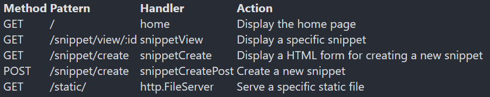

# Advanced routing

В следующем разделе этой книги мы добавим в наше приложение HTML-форму, чтобы пользователи могли создавать новые фрагменты кода.
Чтобы все работало гладко, нам сначала нужно обновить маршруты нашего приложения, чтобы запросы к /snippet/create обрабатывались по-разному в зависимости от метода запроса. Конкретно:
- Для запросов GET/snippet/create мы хотим показать пользователю HTML-форму для добавления нового фрагмента.
- Для запросов POST /snippet/create мы хотим обработать данные этой формы, а затем вставить новую запись фрагмента в нашу базу данных.

Пока мы этим занимаемся, мы также внесем еще несколько улучшений, связанных с маршрутизацией:
- Мы ограничим все остальные маршруты, которые просто возвращают информацию, поддержкой только запросов GET.
- Мы будем использовать чистые URL-адреса, чтобы любые переменные включались в путь URL-адреса (например, /snippet/view/123), а не добавлялись в качестве строки запроса (например, /snippet/view?id=123).

We’ll use clean URLs so that any variables are included in the URL path (like /snippet/view/123) and not appended as a query string (like /snippet/view?id=123).

По сути, мы хотим изменить маршруты и обработчики наших приложений так, чтобы они выглядели следующим образом:

Servemux Go не поддерживает маршрутизацию на основе методов или чистые URL-адреса с переменными в них. Есть несколько уловок, которые можно использовать, чтобы обойти эту проблему, но большинство людей склонны решать, что проще воспользоваться сторонним пакетом, который поможет с маршрутизацией.